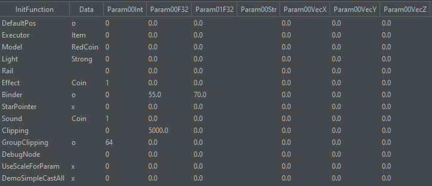

# Actor Tutorials

_This tutorial requires C++ knowledge, as well as knowledge on how to create a new Code module using [Syati](https://github.com/SMGCommunity/Syati). Currently, coding a custom actor only properly works with SMG2, though SMG1 support is planned._

### What is an actor?

The base class of every object in Super Mario Galaxy is `NameObj`. These are basic objects that can be drawn, but that do not have a physical position and state.  
Most objects goes a step further and inherit from `LiveActor`. The `LiveActor` class provides the necessary structure to create more complex objects, `NameObj`s on the other hand cannot really do that much.  
For the rest of this guide, when referring to an "actor", I am referring to an object that inherits `LiveActor`.

### Creating your own actor

Once you have created a new Syati module, create a new `CustomActor.h` file in the include/ folder. In here we first define the class of our actor:

```
#pragma once
#include "syati.h"

class CustomActor : public LiveActor {
public:
    CustomActor(const char *pName);
    virtual void init(const JMapInfoIter &rIter);
    virtual void movement();
    virtual void control();
};
```

Now, inside the source/ directory, create a new `CustomActor.cpp` file and include your class:

```
#include "CustomActor.h"

CustomActor::CustomActor(const char *pName) : LiveActor(pName) {
	
}
```

The `constructor` (ctor) gets called when the actor first gets created. For creating _placeable_ objects, you have to inherit `LiveActor::LiveActor(pName)` (shortened here to simply `LiveActor(pName)`).  
Both `movement` and `control` are called on every frame, so you can put your own code in there. However, there are important differences:

*   Placing your code in `movement` will disable its movement capabilities, making it static. If you want to make a non-moving actor anyways, you can use this, otherwise go for `control`.
*   Placing your code in `control` will disable nothing and just run your code. However, this function is only available to `LiveActor`s, so if you are making a `NameObj`, go for `movement`.

The `init` function gets called on the first frame the actor exists, and this is what it should look like. Depending on how complex your actor is, yours may look different:

```
void CustomActor::init (const JMapInfoIter &rIter) {
	MR::initDefaultPos(this, rIter);
	MR::processInitFunction(this, rIter, false);
	MR::connectToSceneMapObj(this);
	makeActorAppeared();
	MR::validateClipping(this);
}
```

`MR::initDefaultPos` places the actor at it's intended default position.  
`MR::processInitFunction` does basic actor initialization. You can also call it with a model name instead of a JMapInfoIter, in case the name of the model is different to the name of your actor.  
`MR::connectToSceneMapObj` adds it to the current game scene. You can also call a variation of this like `MR::connectToSceneEnemy` depending on your use case.  
`makeActorAppeared` is not just required for visual models to appear, but also for the actor to start functioning properly.  
Finally, we call `MR::validateClipping` to make the actor disappear when the player is far enough away. If you want it to always stay visible, call `MR::invalidateClipping` instead.  
  
Now, to make the game recognize our new actor, we need to add an entry to the `NameObjFactory`. To do that, clone its Syati module and then add this to your own `ModuleInfo.json` file:

```
"ModuleData" : [
  {
    "NameObjFactory" : [
	  {
	    "Name" : "CustomActor",
	    "Function" : "createExtActor<CustomActor>",
	    "Include" : "CustomActor.h"
	  }
	]
  }
]
```

This makes the game know what your actor is called. From now on, placing a `CustomActor` object in the level will spawn in your actor.

**If your actor is visible, make sure you also have a CustomActor.arc file in the ObjectData/ folder of SMG2.**

Some additional functions that could be useful as well:

*   `MR::getJMapInfoArgXNoInit(rIter, &someMember);` - Gets the obj\_arg*X* set on the object and stores it in `someMember` (replace *X* with a number between 0 - 7). If the arg is NULL, it will not overwrite the contents of `someMember`. For each function there are three overloads for a `bool *`, `s32 *` or `f32 *`.
*   `MR::useStageSwitchWriteDead(this, rIter);` - Makes the actor turn on its SW\_DEAD when it is killed. You can also write to SW\_A and SW\_B using similar functions. To actually turn it on or off, use `MR::onSwitchA(this);` or `MR::offSwitchA(this);` later in the code.
*   `MR::useStageSwitchReadAppear(this, rIter);` - Makes the actor spawn when its SW\_APPEAR turns on. You can also read from SW\_A and SW\_B using similar functions. To check if the switch is turned on, use `MR::isOnSwitchA(this);`.
*   `MR::declareStarPiece(this, X);` or `MR::declareCoin(this, X);` - Makes the actor hold *X* starbits/*X* coins that can be released later on with `MR::appearStarPiece` or `MR::appearCoin...`.
*   `MR::onCalcGravity(this);` - Makes the actor respond to the gravity that it is in.
*   `MR::initShadowVolumeSphere(this, 100.0f);` - Gives the actor a round shadow with a radius of 100. There are multiple functions like this that change the respective shape, as well as one that allows you to use a bcsv for shadow data.
*   `MR::initStarPointerTarget(this, 100.0f, TVec3f(0.0f, 0,0f, 0.0f));` - Allows the actor to be targeted by the Cursor. The second argument should match the radius of your HitSensor, the last argument is a offset vector.
*   `initBinder(100.0f, 0.0f, 0);` - Adds a binder to the actor that is able to detect walls, floors and ceilings with `MR::isBinded...`. The first argument should match the radius of your HitSensor.

### About HitSensors

To allow your actor to have a "hit sphere" that can interact with the player or other actors, you need to add a HitSensor. HitSensors are always spherical, and you need to specify a radius in game units when creating it. Add the following to your init function:

```
initHitSensor(1);
MR::addHitSensorMapObj(this, "Body", 8, 100.0f, TVec3f(0.0f, 0.0f, 0.0f));
```

Firstly, we initialize exactly one HitSensor. Then we add it to our object with the following parameters:

*   `this` is a pointer to our custom actor.
*   `"Body"` is the name of the sensor we want to apply. For one sensor you can just use "Body", but when using multiple HitSensors you can use multiple names to distinguish between them.
*   `8` represents the receiverCount. This specifies how many objects can interact with the HitSensor at once.
*   `100.0f` is the radius of the HitSensor, in this case 100 units.
*   `TVec3f(0.0f, 0.0f, 0.0f)` represents the offset from the main actor. Here we simply create a new 0, 0, 0 vector so that the HitSensor gets placed at the origin of our actor. You can simply change each coordinate based on your needs.

It is also possible to add different types of HitSensors by using a different `MR::addHitSensor...` function, or by simply using `MR::addHitSensor` itself, which adds a u32 parameter for the type of sensor:

```
MR::addHitSensor(this, "Body", ATYPE_MAP_OBJ, 8, 100.0f, TVec3f(0));
```

To see which types you can use or what functions are available, check the HitSensor.h file in Syati's include/Game/LiveActor directory.

Once our HitSensor is added, we also need to handle something interacting with that HitSensor. For this, you can use four different functions depending on your needs.

```
class CustomActor : public LiveActor {
public:
	// ...
	virtual void attackSensor(HitSensor *, HitSensor *);
	virtual bool receiveMsgPlayerAttack(u32, HitSensor *, HitSensor *);
	virtual bool receiveMsgEnemyAttack(u32, HitSensor *, HitSensor *);
	virtual bool receiveOtherMsg(u32, HitSensor *, HitSensor *);
	// ...
}
```

To see which message you are working with or what functions are available, look at the HitSensor.h file in Syati's include/Game/LiveActor directory.

*   `attackSensor` is called whenever the HitSensor collides with another HitSensor. The first HitSensor is the one from our custom actor, the second one is what it collided with.
*   `receiveMsgPlayerAttack` is called whenever the Player interacts with the HitSensor. The u32 is the message that was sent from the Player to the actor. The first HitSensor is from the player, the second one is from our actor.
*   `receiveMsgEnemyAttack` is called whenever an Enemy interacts with the HitSensor. The u32 is the message that was sent from the Enemy to the actor. The first HitSensor is from the enemy, the second one is from our actor.
*   `receiveOtherMsg` is called for any message that the actor receives. The u32 is the message that was sent from the object to the actor. The first HitSensor is from the object, the second one is from our actor.
  

After that, to actually define the function, place this into your C++ file:

```
bool CustomActor::receiveMsgPlayerAttack (u32 msg, HitSensor *pSender, HitSensor *pReceiver) {

}
```

To figure out what type the sender is, you can call one of the 25 `MR::isSensor...` functions. When checking for the player, using `MR::isSensorPlayerOrYoshiOrRide(pSender)` is recommended. To figure out what type of interaction ocurred, use one of the 105 `MR::isMsg` functions or manually compare it to the respective number. For example, the player spin-attacking your actor can be checked by calling `MR::isMsgPlayerSpinAttack(msg)`. Remember that any of these functions (except for `attackSensor`) has to return a bool. This is needed to let the sender of the message know that there was an interaction (`true`) or that it was simply ignored (`false`). For example, if the player interacts with it and true is returned, a certain particle effect may be created to show the impact.  
If you need to check which one of your multiple HitSensors got interacted with, you can compare `pReceiver` with `getSensor(X)` (replace *X* with the name of the HitSensor you want to check for).

### About Collision

Some actors also feature collision on top of a HitSensor, which needs to be initialized seperately. To do that, add this to the init function of your actor:

```
MR::initCollisionParts(this, "Custom", getSensor("body"), NULL);
```

This function gets passed the following arguments:

*   `this` is a pointer to our custom actor.
*   `"CustomActor"` is the name of the collision file that the game should use. In this case, the game uses the CustomActor.kcl file in ObjectData/CustomActor.arc.
*   `getSensor("Body")` is needed to let the game know where to place the CollisionParts. Here we simply get the sensor named "Body".
*   `NULL` is usually a MtxPtr. When given a valid MtxPtr, the game will tie the collision to that matrix. Otherwise, it stays at the HitSensor's position.

From there, you can also turn this collision on or off by using `MR::validateCollisionParts(this);` or `MR::invalidateCollisionParts(this);`

### Using ActorInfo

You can eliminate the need for a bunch of code in your `init` function by using a few ActorInfo bcsv files. Here is an example of a InitActor.bcsv from the [Project Template](projects.html#pt)'s RedCoin:



Here's a breakdown of what these entries do:

*   _DefaultPos_ will call `MR::initDefaultPos` if Data is set to o (equivalent of `true`). If set to x (equivalent of `false`), it will not call the function.
*   _Executor_ will call `MR::connectToScene<Type><Light>` with <Type> being what Data is.
*   _Light_ will call `MR::connectToScene<Type><Light>` with <Light> being what Data is (in this example, `MR::connectToSceneItemStrongLight`).
*   _Model_ tells the game what model to load in and from what file.
*   _Rail_ tells the game whether your actor uses a path. Setting Data to an empty string means it will not use a path, using `Use` means it can use one, and using `Needs` means it has to use one.
*   _Binder_ will call `initBinder(<radius>, ...)` with <radius> being what Param00F32 is.
*   _StarPointer_ will call `initStarPointerTarget`, to make it a target for the Star Pointer if the Data field is set to o. Here it is set to x however (equivalent of false).
*   _Sound_ will specify the sound group to use.
*   _Clipping_ specifies at what distance the object is far enough away to disappear.
*   _DebugNode_ is useless lol.
*   _UseScaleForParam_ allows you to specify whether the actor should scale or not.